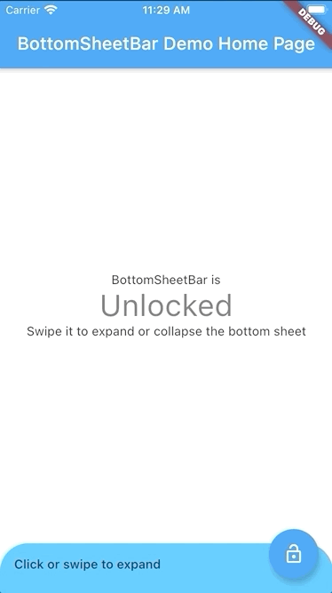
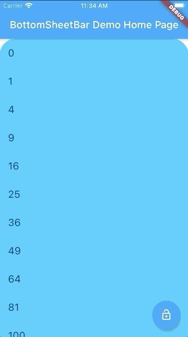

# bottom_sheet_bar

A toolbar that aligns to the bottom of a widget and expands into a bottom sheet.

| Short content           | Long content      | Scrollable content |
|:-----------------------:|:-----------------:|:------------------:|
|     |  |     |

```dart
import 'package:bottom_sheet_bar/bottom_sheet_bar.dart';

BottomSheetBar(
    expandedBuilder: (scrollController) => ListView.builder(
        controller: scrollController, 
        itemBuilder: (context, index) => ListTile(title: index.toString()),
        itemCount: 50,
    ),
    collapsed: Text('Collapsed toolbar widget'),
    body: Text('Content overlayed by toolbar and bottom sheet'),
);
```

## `BottomSheetBar`

#### __Required__
- **`Widget body`** - The toolbar will be aligned to the bottom of the body `Widget`. Padding equal to `height` is added to the bottom of this widget.
- **`Function(ScrollController) expandedBuilder`** - A function to build the widget displayed when the bottom sheet is expanded. If the expanded content is scrollable, pass the provided `ScrollController` to the scrollable widget.

#### __Optional__
- **`Widget collapsed`** - A `Widget` to be displayed on the toolbar in its collapsed state
- **`BottomSheetBarController controller`** - A controller can be used to listen to events, and expand and collapse the bottom sheet.
- **`Color color`** - The background color of the toolbar and bottom sheet. Defaults to `Colors.white`
- **`Color backdropColor`** - The backdrop color that overlays the [body] widget when the bottom sheet is expanded. Defaults to `Colors.transparent` (no backdrop)
- **`BorderRadius borderRadius`** - Provide a border-radius to adjust the shape of the toolbar
- **`BorderRadius borderRadiusExpanded`** - Provide a border-radius to adjust the shape of the bottom-sheet when expanded
- **`double height`** - The height of the collapsed toolbar. Default to `kToolbarHeight` (56.0)
- **`bool isDismissable`** - If `true`, the bottom sheet can be dismissed by tapping elsewhere. Defaults to `true`
- **`bool locked`** - If `true`, the bottom sheet cannot be opened or closed with a swipe gesture. Defaults to `true`

## `BottomSheetBarController`

A controller used to expand or collapse the bottom sheet of a `BottomSheetBar`. Listeners can be added to respond to expand and collapse events. The expanded or collapsed state can also be determined through this controller.

- **`bool get isCollapsed`** - Only returns [true] if the bottom sheet if fully collapsed
- **`bool get isExpanded`** - Only returns [true] if the bottom sheet if fully expanded
- **`TickerFuture collapse()`** - Collapse the bottom sheet built by `BottomSheetBar.expandedBuilder`
- **`TickerFuture expand()`** - Expand the bottom sheet built by `BottomSheetBar.expandedBuilder`
- **`void addListener(Function listener)`** - Adds a function to be called on every animation frame
- **`void removeListener(Function listener)`** - Removes a previously added listener
- **`void dispose()`** - Removes all previously added listeners
- **`void attach(AnimationController animationController)`** - Used internally to assign the `AnimationController` created by `BottomSheetBar` to the controller. Unless you're using advanced animation techniques, you probably won't ever need to use this method.

## Example

A quick demonstration can be found in the `example` directory. To run the example:

`flutter run example/main.dart`